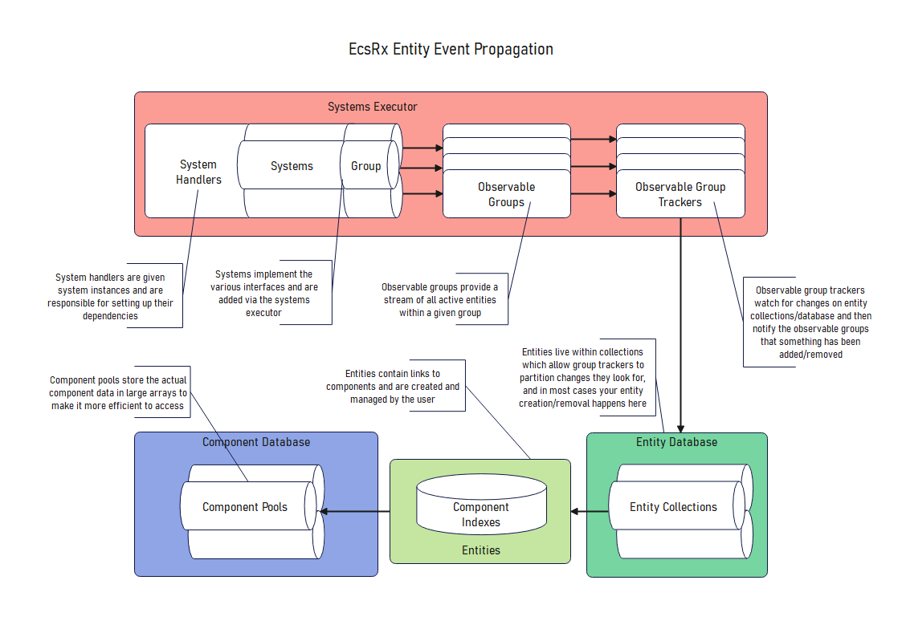

# High Level Architecture

From a high level perspective EcsRx is built on top of SystemsRx, we make use of SystemRx's `ISystemsExecutor` and `ISystem` notions while adding our own custom handlers and ECS paradigms on top.

If we were to look at the highest level of what the MAIN architectural components were it would look something like this:

## Systems Executor

As you can see we have the `Systems Executor` section which is where all systems end up within the framework, they are all setup internally by registered `System Handlers` which understand how to process certain kinds of system and wire up dependencies.

> In the real world most of the handlers are `IConventionalSystemHandler` implementations and you can make your own versions of these if you want

### Observable Groups

As systems use groups as their contracts we have `Observable Group` objects which deal with maintaining a list of applicable entities and notify any subscribers when they change in any way.

> There is a plugin which extends this further with the notion of `IComputedGroup` which wraps an observable group and filters/constrains it further.

### Observable Group Trackers

The last part of the `System Executor` section is the `Observable Group Trackers` which watch entity collections and notify when entities add/leave a group, this makes the `Observable Group` the storage of what entities are actually in the group, and the trackers just notify it when to change.

> There are various flavours of `ObservableGroupTracker` implementations, we use the Collection based one here but there are ones for individual entity tracking against groups or batched ones too.

## Entity Database

So the entity database contains all entity collections and acts as a sort of proxy to let you query into all collections if you need to, however in most cases you would deal with individual collections directly.

### Entity Collection

These objects just store entities and notify any listeners when entities are added/removed or components change, you can find out more [Here](entity-collections.md).

### Entities

Entities are the main thing developers interact with as they are the data containers that get bounced around the system, to find out more look in the [Entity Docs](../framework/entities.md).

## Component Database

The component database stores all the actual component data in large arrays, this allows us to more quickly access component data.

> Historically components were stored on entities but it causes the memory to become extremely fragmented so this gives a large performance benefit without anyone really needing to know whats going on.

### Component Pools

These are the large arrays (simply speaking) that contain all the actual component data.