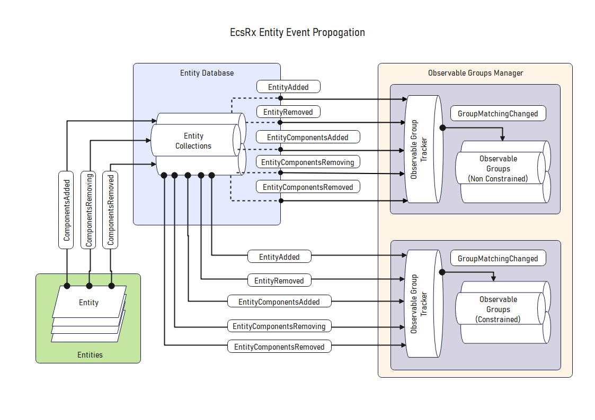

# Observable Groups

So now you know what entities are and how you can get hold of them, its worth going over how observable groups work and how the flow of entities goes through the eco-system.

## Filtration Flow

```
IObservableGroupManager 	<-  This contains the database which contains all collections, which in turn contains ALL entities
     |
     |
IObservableGroup      		<-  This filters all entities down to only ones which are within the group
     |                    		i.e All entities which contain PlayerComponent
     |
IComputedGroup        		<-  This acts as another layer of filtration on an IObservableGroup
                          		i.e Top 5 entities with PlayerComponent sorted by Score
```

Here is a diagram which shows at a high level how they all hook together.



## IObservableGroupManager

The observable group manager maintains a collection of `IObservableGroup` so if you have 5 systems which all use the same group, there will only actually be 1 instance of the `IObservableGroup` that is shared between them all. 

## IObservableGroup

The observable group is created within and maintained by an `IEntityCollectionManager` and exposes all entities which match the associated group. It also exposes observables to represent when an entity has been added or removed from the underlying group.

Under the hood, the observable group watches entities (via `IObservableGroupTrackers`) to see when they are added/removed from pools as well as when their components change. When this occurs it will check to see if it effects the current group and if so it updates it internal list accordingly.

This has a huge performance benefit as it will stop you needing to evaluate linq chains into the underlying pools and just give you a cached list of all entities currently matching, given also that these observable groups are shared between any systems that require the same underlying components it can save a lot of resources.

## IObservableGroupTracker

This acts as the notifying mechanism for Observable groups to know when changes happen to the underlying entity data.

## IComputedGroup

The computed group is created manually and requires an `IObservableGroup` for it to use for the basis of its queries. It is provided to allow you to filter past the group level and get more specific data sets without having to hard code the logic for the lookup in various systems.

General use cases for this may be things like:

- Get 5 highest scoring players
- Get enemies within a radius of the player
- Get all units within current squad

It is meant to be an interface for you to implement with your own filtration logic, and this is internally cached and exposes its own added/removed state handlers so you can subscribe to them just like an ObservableGroup.

### `ComputedGroup`

This implementation has caching built in so it will try to keep a pre-evaluted list of entities which match the filtration requirements, this can be beneficial if you are using this in a few places and want it to update automatically when the underlying data changes.

> This now needs the `EcsRx.Plugins.Computeds` nuget package, as the computed functionality has been moved there.

## Query Object

So up to this point we have discussed the general filtration process, however there are some extension methods which let you do more ad-hoc queries on data, these are not cached in any way but allow you to drill down into a subset of data in a pre-defined way, this overlaps a bit with the `IComputedGroup` but lets you query directly at the pool level or accessor level.

Both `IEntityCollection` and `IObservableGroup` has a `Query` extension method which takes an `IEntityCollectionQuery` or `IObservableGroupQuery` where you can implement your desired query logic. This was added so you could use the pools and group accessors more like repositories and use pre defined queries to access them consistently.
